# UL Solutions Equipment Certification — Data Model (ERD)

## Entity Relationship Diagram

```mermaid
erDiagram
    %% ========================================================
    %% BRONZE LAYER — Structured Data (from Parquet in UC Volume)
    %% ========================================================

    bronze_facilities {
        STRING facility_id PK
        STRING facility_name
        STRING city
        STRING state_province
        STRING country
        STRING region
        STRING facility_type
        INT    square_footage
        INT    employee_count
        DATE   opened_date
        TIMESTAMP _ingested_at
        STRING    _source_file
    }

    bronze_equipment_inventory {
        STRING asset_id PK
        STRING model_number
        STRING equipment_type
        STRING equipment_type_code
        STRING manufacturer
        STRING facility_id FK
        STRING serial_number
        DATE   purchase_date
        DOUBLE purchase_price_usd
        DATE   warranty_expiration
        STRING operational_status
        STRING voltage_rating
        STRING ip_rating
        DATE   last_inspection_date
        DATE   next_inspection_due
        STRING install_location
        TIMESTAMP _ingested_at
        STRING    _source_file
    }

    bronze_work_orders {
        STRING    work_order_id PK
        STRING    asset_id FK
        STRING    work_order_type
        STRING    priority
        STRING    status
        TIMESTAMP created_at
        DATE      scheduled_date
        DATE      completed_date
        STRING    technician_name
        STRING    description
        DOUBLE    labor_hours
        DOUBLE    parts_cost_usd
        DOUBLE    downtime_hours
        TIMESTAMP _ingested_at
        STRING    _source_file
    }

    bronze_manufacturer_contracts {
        STRING contract_id PK
        STRING manufacturer
        STRING contract_type
        DATE   start_date
        DATE   end_date
        DOUBLE annual_value_usd
        INT    sla_response_hours
        STRING contract_status
        STRING primary_contact
        STRING contact_email
        TIMESTAMP _ingested_at
        STRING    _source_file
    }

    %% ========================================================
    %% BRONZE LAYER — Unstructured Data (PDFs from UC Volume)
    %% ========================================================

    bronze_equipment_docs {
        STRING    file_path PK
        BINARY    file_content
        LONG      file_size_bytes
        TIMESTAMP file_modified_at
        TIMESTAMP _ingested_at
        STRING    _source_file
    }

    %% ========================================================
    %% SILVER LAYER — AI-Parsed Documents
    %% ========================================================

    silver_parsed_equipment {
        STRING    file_path PK
        LONG      file_size_bytes
        STRING    file_name
        STRING    document_text
        STRING    parse_version
        INT       num_pages
        INT       num_tables
        INT       num_figures
        INT       num_text_blocks
        ARRAY     table_contents
        ARRAY     figure_descriptions
        VARIANT   parsed_doc
        TIMESTAMP _ingested_at
        TIMESTAMP _parsed_at
    }

    %% ========================================================
    %% GOLD LAYER — Business-Ready Views
    %% ========================================================

    gold_equipment_catalog {
        STRING    file_path PK
        STRING    file_name
        STRING    equipment_name
        STRING    model_number
        STRING    manufacturer
        STRING    equipment_type
        STRING    certification_id
        STRING    certification_status
        STRING    safety_rating
        STRING    material_type
        DOUBLE    weight_kg
        STRING    voltage_rating
        STRING    ip_rating
        DOUBLE    operating_temp_min_c
        DOUBLE    operating_temp_max_c
        STRING    compliance_standards
        STRING    document_text
        INT       num_pages
        INT       num_tables
        INT       num_figures
        TIMESTAMP _ingested_at
        TIMESTAMP _parsed_at
    }

    gold_table_specifications {
        STRING    file_path FK
        STRING    file_name
        INT       table_index
        STRING    table_html
        STRING    equipment_name
        STRING    model_number
        STRING    manufacturer
        TIMESTAMP _parsed_at
    }

    gold_figure_descriptions {
        STRING    file_path FK
        STRING    file_name
        INT       figure_index
        STRING    figure_description
        STRING    equipment_name
        STRING    model_number
        STRING    manufacturer
        TIMESTAMP _parsed_at
    }

    gold_equipment_360 {
        STRING asset_id PK
        STRING serial_number
        STRING inventory_model_number
        STRING equipment_type
        STRING equipment_type_code
        STRING manufacturer
        STRING facility_id
        STRING facility_name
        STRING city
        STRING state_province
        STRING country
        STRING region
        STRING facility_type
        STRING operational_status
        STRING install_location
        STRING voltage_rating
        STRING inventory_ip_rating
        DATE   purchase_date
        DOUBLE purchase_price_usd
        DATE   warranty_expiration
        DATE   last_inspection_date
        DATE   next_inspection_due
        STRING warranty_status
        STRING inspection_status
        STRING certification_id
        STRING certification_status
        STRING safety_rating
        STRING certified_ip_rating
        STRING material_type
        DOUBLE weight_kg
        DOUBLE operating_temp_min_c
        DOUBLE operating_temp_max_c
        STRING compliance_standards
        STRING certified_model_number
        STRING certification_document
        BOOLEAN has_certification
        STRING contract_id
        STRING contract_type
        STRING contract_status
        INT    sla_response_hours
        DOUBLE contract_annual_value_usd
    }

    gold_maintenance_insights {
        STRING asset_id PK
        STRING model_number
        STRING equipment_type
        STRING manufacturer
        STRING serial_number
        STRING operational_status
        STRING facility_name
        STRING city
        STRING region
        INT    total_work_orders
        INT    completed_work_orders
        INT    open_work_orders
        INT    emergency_repairs
        INT    corrective_repairs
        INT    preventive_maintenance_count
        DOUBLE total_labor_hours
        DOUBLE total_parts_cost_usd
        DOUBLE total_downtime_hours
        DOUBLE avg_labor_hours_per_wo
        DATE   last_completed_wo
        DATE   next_scheduled_wo
        INT    critical_priority_count
        INT    high_priority_count
        DOUBLE total_maintenance_cost_usd
        STRING certification_id
        STRING certification_status
        STRING safety_rating
        STRING compliance_standards
        STRING risk_level
        DATE   last_inspection_date
        DATE   next_inspection_due
        STRING inspection_status
        STRING contract_status
        INT    sla_response_hours
    }

    %% ========================================================
    %% RELATIONSHIPS
    %% ========================================================

    %% Structured data joins
    bronze_facilities            ||--o{ bronze_equipment_inventory : "facility_id"
    bronze_equipment_inventory   ||--o{ bronze_work_orders         : "asset_id"
    bronze_manufacturer_contracts }o--o{ bronze_equipment_inventory : "manufacturer"

    %% Unstructured pipeline flow
    bronze_equipment_docs        ||--|| silver_parsed_equipment     : "file_path (ai_parse_document)"
    silver_parsed_equipment      ||--|| gold_equipment_catalog      : "file_path (ai_query)"
    silver_parsed_equipment      ||--o{ gold_table_specifications   : "file_path (posexplode)"
    silver_parsed_equipment      ||--o{ gold_figure_descriptions    : "file_path (posexplode)"

    %% Gold cross-references (catalog enrichment)
    gold_equipment_catalog       }o--o{ gold_table_specifications   : "file_path"
    gold_equipment_catalog       }o--o{ gold_figure_descriptions    : "file_path"

    %% Gold 360 view (structured + unstructured join)
    bronze_equipment_inventory   }o--|| gold_equipment_360          : "asset_id (base)"
    bronze_facilities            }o--|| gold_equipment_360          : "facility_id"
    gold_equipment_catalog       }o--o{ gold_equipment_360          : "manufacturer + equipment_type"
    bronze_manufacturer_contracts }o--o{ gold_equipment_360         : "manufacturer"

    %% Gold maintenance insights
    bronze_equipment_inventory   }o--|| gold_maintenance_insights   : "asset_id (base)"
    bronze_facilities            }o--|| gold_maintenance_insights   : "facility_id"
    bronze_work_orders           }o--o{ gold_maintenance_insights   : "asset_id (aggregated)"
    gold_equipment_catalog       }o--o{ gold_maintenance_insights   : "manufacturer + equipment_type"
    bronze_manufacturer_contracts }o--o{ gold_maintenance_insights  : "manufacturer"

    %% Metric view (unified semantic model — joins both gold views)
    gold_equipment_360           ||--|| equipment_certification_metrics : "primary source"
    gold_maintenance_insights    ||--|| equipment_certification_metrics : "joined on asset_id"

    equipment_certification_metrics {
        STRING _type_ "METRIC VIEW (joined)"
        STRING source "gold_equipment_360"
        STRING joined "gold_maintenance_insights ON asset_id"
        STRING ___ "--- DIMENSIONS (17) ---"
        STRING dim_equipment_type "equipment_type"
        STRING dim_manufacturer "manufacturer"
        STRING dim_voltage_rating "voltage_rating"
        STRING dim_certification_status "certification_status"
        STRING dim_certified_ip_rating "certified_ip_rating"
        STRING dim_safety_rating "safety_rating"
        STRING dim_material_type "material_type"
        STRING dim_compliance_standards "compliance_standards"
        STRING dim_facility_name "facility_name"
        STRING dim_city "city"
        STRING dim_region "region"
        STRING dim_facility_type "facility_type"
        STRING dim_operational_status "operational_status"
        STRING dim_warranty_status "warranty_status"
        STRING dim_inspection_status "inspection_status"
        STRING dim_contract_status "contract_status"
        STRING dim_risk_level "maintenance.risk_level"
        STRING ____ "--- MEASURES (37) ---"
        STRING msr_asset_counts "Total / Active / Under Maint / Decommissioned"
        STRING msr_certification "Certified / Uncertified / Pass / Conditional / Pass Rate"
        STRING msr_financial "Purchase Value / Avg Price / Contract Value"
        STRING msr_warranty_insp "Expired / Expiring / Overdue / Due Soon"
        STRING msr_cert_specs "Avg Weight / Avg Temp Range"
        STRING msr_cardinality "Distinct Facilities / Manufacturers"
        STRING msr_work_orders "Total / Open / Completed / Emergency / Corrective / Preventive"
        STRING msr_cost_downtime "Maint Cost / Avg Cost / Parts / Labor Hrs / Avg Labor / Downtime"
        STRING msr_risk_priority "High Risk / Medium Risk / Elevated / Critical WO / High WO"
    }
```



## Pipeline Data Flow

```
                    UC Volume (Parquet)                    UC Volume (PDFs)
                    ─────────────────                      ────────────────
                   /    |    |    \                               |
                  v     v    v     v                              v
    ┌──────────────┐ ┌────────────┐ ┌─────────────┐ ┌────────────────────┐  ┌───────────────────┐
    │   bronze_    │ │  bronze_   │ │  bronze_    │ │bronze_manufacturer_│  │bronze_equipment_  │
    │ facilities   │ │ equipment_ │ │work_orders  │ │   contracts        │  │     docs          │
    │   (8 rows)   │ │ inventory  │ │ (500 rows)  │ │    (10 rows)       │  │   (10 PDFs)       │
    │              │ │ (120 rows) │ │             │ │                    │  │                   │
    └──────┬───────┘ └─────┬──────┘ └──────┬──────┘ └─────────┬──────────┘  └────────┬──────────┘
           │               │               │                  │                      │
           │               │               │                  │            ai_parse_document()
           │               │               │                  │                      │
           │               │               │                  │              ┌───────v──────────┐
           │               │               │                  │              │silver_parsed_    │
           │               │               │                  │              │  equipment       │
           │               │               │                  │              └───┬────┬────┬────┘
           │               │               │                  │                  │    │    │
           │               │               │                  │           ai_query()  │  posexplode()
           │               │               │                  │                  │    │    │
           │               │               │                  │   ┌──────────────v┐   │   ┌v──────────────┐
           │               │               │                  │   │gold_equipment_│   │   │gold_table_    │
           │               │               │                  │   │   catalog     │   │   │specifications │
           │               │               │                  │   └──────┬────────┘   │   └──────────────-┘
           │               │               │                  │          │            │
           │               │               │                  │          │        ┌───v──────────────┐
           │               │               │                  │          │        │gold_figure_      │
           │               │               │                  │          │        │ descriptions     │
           │               │               │                  │          │        └──────────────────┘
           │               │               │                  │          │
           └───────────────┴───────────────┴──────────────────┴──────────┘
                                           │
                              ┌────────────┴────────────┐
                              v                         v
                 ┌────────────────────┐    ┌──────────────────────┐
                 │ gold_equipment_360 │    │gold_maintenance_     │
                 │   (360° View)     │    │    insights           │
                 └────────┬──────────┘    └──────────┬───────────┘
                          │                          │
                          │   JOIN ON asset_id       │
                          └────────────┬─────────────┘
                                       v
                          ┌─────────────────────────┐
                          │  Metric View:           │
                          │  equipment_             │
                          │  certification_metrics  │
                          │                         │
                          │  17 dimensions          │
                          │  37 measures            │
                          └────────────┬────────────┘
                                       │
                          ┌────────────┴────────────┐
                          v                         v
                 ┌────────────────┐    ┌─────────────────────┐
                 │  Genie Space   │    │ Knowledge Assistant │
                 │  (SQL Q&A)    │    │  (Document Q&A)     │
                 └───────┬────────┘    └──────────┬──────────┘
                         │                        │
                         └───────────┬────────────┘
                                     v
                          ┌─────────────────────┐
                          │  Multi-Agent        │
                          │  Supervisor         │
                          │  (Orchestrator)     │
                          └─────────────────────┘
```

## Join Keys Summary

| Relationship | Join Key(s) | Type | Notes |
|---|---|---|---|
| facilities -> equipment_inventory | `facility_id` | 1:N | Each facility has many assets |
| equipment_inventory -> work_orders | `asset_id` | 1:N | Each asset has many work orders |
| manufacturer_contracts -> equipment_inventory | `manufacturer` | N:M | One contract per manufacturer, many assets per manufacturer |
| equipment_inventory -> gold_equipment_catalog | `manufacturer` + `equipment_type` | N:M | Fuzzy match — model numbers may differ between ERP and cert docs |
| bronze_equipment_docs -> silver_parsed_equipment | `file_path` | 1:1 | Each PDF parsed once |
| silver_parsed_equipment -> gold_equipment_catalog | `file_path` | 1:1 | AI extracts structured fields from each doc |
| silver_parsed_equipment -> gold_table_specifications | `file_path` | 1:N | Each doc may have multiple tables |
| silver_parsed_equipment -> gold_figure_descriptions | `file_path` | 1:N | Each doc may have multiple figures |
| **gold_equipment_360 -> metric view** | `asset_id` (primary source) | 1:1 | Metric view primary source |
| **gold_maintenance_insights -> metric view** | `asset_id` (joined) | 1:1 | Metric view join for work order / risk data |

## Metric View Composition

The `equipment_certification_metrics` metric view unifies both gold views into a single governed semantic model:

| Source | Join | Provides |
|---|---|---|
| `gold_equipment_360` | Primary source | Inventory, facilities, certifications, contracts, warranty/inspection status |
| `gold_maintenance_insights` | `JOIN ON asset_id` | Work orders, labor hours, parts costs, downtime, maintenance cost, risk flags, priority counts |

**17 dimensions** across 6 categories:

| Category | Dimensions |
|---|---|
| Equipment identity | Equipment Type, Manufacturer, Voltage Rating |
| Certification | Certification Status, Certified IP Rating, Safety Rating, Material Type, Compliance Standards |
| Facility | Facility Name, City, Region, Facility Type |
| Operational status | Operational Status, Warranty Status, Inspection Status, Contract Status |
| Risk (from maintenance) | Risk Level |

**37 measures** across 9 categories:

| Category | Measures | Source |
|---|---|---|
| Asset counts | Total Assets, Active, Under Maintenance, Decommissioned | gold_equipment_360 |
| Certification | Certified, Uncertified, Pass Count, Conditional Count, Pass Rate | gold_equipment_360 |
| Financial | Total Purchase Value, Avg Purchase Price, Total Contract Value | gold_equipment_360 |
| Warranty & inspections | Expired Warranties, Expiring Soon, Overdue Inspections, Due Soon | gold_equipment_360 |
| Certification specs | Avg Weight, Avg Operating Temp Range | gold_equipment_360 |
| Cardinality | Distinct Facilities, Distinct Manufacturers | gold_equipment_360 |
| Work orders | Total, Open, Completed, Emergency, Corrective, Preventive | gold_maintenance_insights |
| Cost & downtime | Total Maint Cost, Avg Cost/Asset, Parts Cost, Labor Hrs, Avg Labor/WO, Downtime Hrs | gold_maintenance_insights |
| Risk & priority | High Risk Assets, Medium Risk, Elevated, Critical WO, High Priority WO | gold_maintenance_insights |

## Layer Summary

| Layer | Table | Type | Row Count | Source |
|---|---|---|---|---|
| **Bronze** | `bronze_facilities` | Streaming Table | 8 | Parquet (structured) |
| **Bronze** | `bronze_equipment_inventory` | Streaming Table | 120 | Parquet (structured) |
| **Bronze** | `bronze_work_orders` | Streaming Table | 500 | Parquet (structured) |
| **Bronze** | `bronze_manufacturer_contracts` | Streaming Table | 10 | Parquet (structured) |
| **Bronze** | `bronze_equipment_docs` | Streaming Table | 10 | PDF binary files (unstructured) |
| **Silver** | `silver_parsed_equipment` | Streaming Table | 10 | `ai_parse_document()` on bronze docs |
| **Gold** | `gold_equipment_catalog` | Materialized View | 10 | `ai_query()` on silver parsed text |
| **Gold** | `gold_table_specifications` | Materialized View | ~40 | Exploded table HTML from silver |
| **Gold** | `gold_figure_descriptions` | Materialized View | ~20 | Exploded figure descriptions from silver |
| **Gold** | `gold_equipment_360` | Materialized View | 120 | Joins inventory + facilities + certs + contracts |
| **Gold** | `gold_maintenance_insights` | Materialized View | 120 | Aggregated work orders + certs + risk flags |
| **Metrics** | `equipment_certification_metrics` | Metric View | — | 17 dimensions, 37 measures joining gold_equipment_360 + gold_maintenance_insights |

## Agent Bricks (Conversational AI Layer)

| Asset | Name | Source | Purpose |
|---|---|---|---|
| **Genie Space** | UL Solutions Equipment Catalog | `equipment_certification_metrics` (metric view) | Natural language SQL — aggregate queries over certifications, inventory, maintenance, and risk |
| **Knowledge Assistant** | UL Solutions Equipment Docs | `/Volumes/.../equipment_docs/` (PDFs) | RAG document Q&A — specific test results, GD&T tolerances, compliance details |
| **Multi-Agent Supervisor** | UL Solutions Equipment Intelligence | Genie Space + Knowledge Assistant | Intelligent routing — data questions to Genie, document questions to KA |
